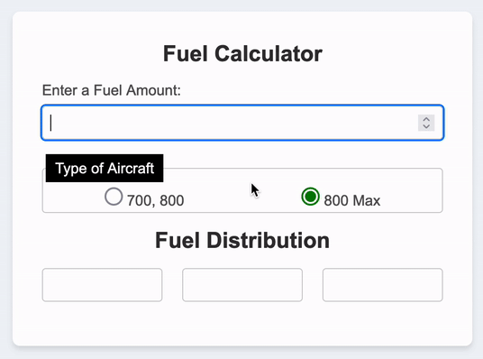

# Calculator

---

Simple form that updates values based on user input and the selection of type of Aircraft used according to the selected radio button.

## Live Demo: [Fuel Calculator](https://volkney.github.io/swa_fuel)
# Live Demo

---

## Types of Aircraft Used

---

There are two constants used to determined the fuel capability of two different configuration of aircrafts

1. 737-700 and 737-800 that use 8.6 

2. 737-800 MAX that use 8.5

### Calculation when fuel amount is less than fuel capability of wings

---

In the case when the fuel is less than the sum of both wings fuel capability: `` 8.6 + 8.6`` or ``8.5 + 8.5`` the value should be divided by **<em>two</em>** and the result should be split equally on both wings, if the division yields two decimals the first wing would take the round **up** and the second wing should take the round **down** of the same value

 

